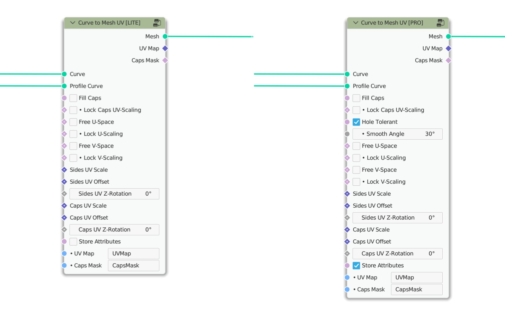

***********
Description
***********

.. raw:: html

    

        <iframe src="https://www.youtube.com/embed/tcePCjJxZ20" frameborder="0" allowfullscreen style="position: absolute; top: 0; left: 0; width: 100%; height: 100%;"></iframe>
    

The `Curve to Mesh <https://docs.blender.org/manual/en/latest/modeling/geometry_nodes/curve/curve_to_mesh.html>`_ node is great, but it is missing an important function: **UV Mapping!**

This node group fills that gap and creates a solid UV mapping along the created mesh.

This way you can finally process your geometry created with Geometry Nodes with your custom shader and use the full power of procedural 3D design in Blender.

What can you use it for?
========================

Any mesh you create in Geometry Nodes with *Curve to Mesh*, once you want to use a specific shader, will need a correct UV mapping. Creating this may be relatively easy for simple shapes. However, if you have multiple profile curves or need more influence on the distribution of the UVs, you will quickly reach the limits.

Especially if you want to extrude letters or other more complex shapes that consist of multiple profile curves, you won't get anywhere with the previous approaches, and you need a sophisticated solution like this.

Why should you buy this thing?
==============================

...Because there is no other reliable alternative!

In the case of *Curve to Mesh*, the `UV Unwrap <https://docs.blender.org/manual/en/latest/modeling/geometry_nodes/uv/uv_unwrap.html>`_ node won't help you either, because in this case it can't create a mapping that exactly follows the topology of the mesh you created.

Where to buy the product?
=========================

You can purchase this product here:

- `Gumroad <https://quellenform.gumroad.com/l/curve-to-mesh-uv>`_
- `Blender Market <https://blendermarket.com/products/curve-to-mesh-uv>`_

What are the advantages of this solution?
=========================================

The advantages of this node group are:

- Can handle closed curves and profiles without distorting the mapping at the endpoints.
- Can be applied to multiple splines at the same time (e.g. segmented splines or multiple curves)
- All in a single node group to keep your project tidy!
- Maximum performance, relatively little additional computational overhead
- Full compatibility in all Blender versions 3.1+ and higher
- UV scaling, UV offset and UV rotation can be changed directly in Geometry Nodes.
- UV mapping can be bound to the topology of the mesh, but can also be defined independently of it
- **Pro:** Can also handle profile curves with holes (e.g. for letters or other complex shapes)
- **Pro:** Correction of normals in case of overlapping profile curves
- **Pro:** Optional generation of sharp edges by detection of edge angles

PS: The *Basic Edition* includes only the calculation of the UVs along the mesh topology!

So what's the difference?
=========================

In contrast to the approach where the cyclic profile curve is converted into a non-cyclic curve (which will destroy the normals), this node group solves the problem performantly directly via the face corners of the mesh.

The advantage of this is that no additional points are inserted to obtain a correct result, which also preserves the normals of the curve, and the required computation time is lower than for other solutions:

In addition, with the *Hole Tolerant* mode, this node group offers the possibility to process intersecting profiles, generating correct caps.

This is important for letters, for example, or other shapes that consist of multiple profile curves, or where the profile curves overlap:

Furthermore, the *Hole Tolerant* mode provides the possibility to correctly align the normals of the generated faces in case of intersecting profiles, as soon as the shapes intersect and a mesh with holes is created, where the faces point in the direction they should point:

What do you get?
================

These beautiful node groups:

Which has the following content (Pro-Version):

Which functions are included in which version?
==============================================

+----------------------------------------------------+-------+------+------+
|                                                    | Basic | Lite | Pro  |
+====================================================+=======+======+======+
| Fill Caps                                          | Yes   | Yes  | Yes  |
+----------------------------------------------------+-------+------+------+
| Length/Factor based Mapping (Topology-independent) |       | Yes  | Yes  |
+----------------------------------------------------+-------+------+------+
| Scale, Offset & Rotate UV-Space (Caps & Sides)     |       | Yes  | Yes  |
+----------------------------------------------------+-------+------+------+
| Store Attributes with custom Names                 |       | Yes  | Yes  |
+----------------------------------------------------+-------+------+------+
| Hole Tolerant (Intersecting Profiles)              |       |      | Yes  |
+----------------------------------------------------+-------+------+------+
| Sharp Edges at specific Angle                      |       |      | Yes  |
+----------------------------------------------------+-------+------+------+
| Supported Blender Versions                         | 3.4+  | 3.1+ | 3.1+ |
+----------------------------------------------------+-------+------+------+
