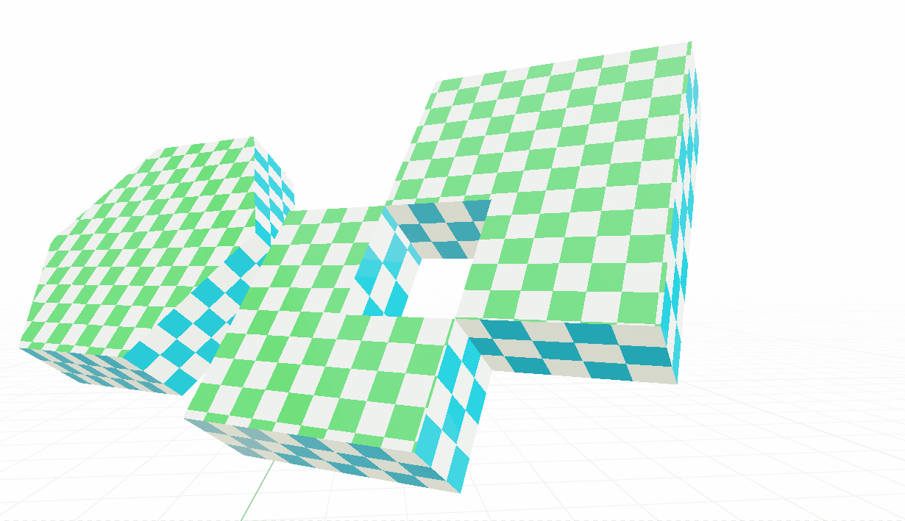

*******
Options
*******

.. image:: images/nodes.jpg

.. contents:: Table of Contents

Fill Caps
=========

When this option is enabled, caps are created at the ends of the base curves. If the *Hole Tolerant* option is also enabled, and several profile curves that extend into each other are used, they will be merged. In this case, the `Fill Curve <https://docs.blender.org/manual/en/latest/modeling/geometry_nodes/curve/operations/fill_curve.html>`_ node is used, which means that all the properties of this node also come into play (use of 2D profile curves, possible removal of identical edges, etc.).

Lock Caps UV-Scaling
--------------------

    *Lock Caps UV-Scaling* **disabled**

    *Lock Caps UV-Scaling* **enabled**

Normally, the UVs for the caps are calculated based on their bounding box. If the *Lock Caps UV-Scaling* option is enabled, a fixed size is assumed for a unit instead, which means that the UV map is not scaled along with the object or its topology.

Hole Tolerant
=============

**(Pro only)**

    *Hole Tolerant* **enabled**

In this mode, profile curves that extend into each other are merged together to create a solid mesh. This process recreates the profile curves and creates a new mesh topology that can correctly handle letters and other complex shapes. In addition, the normals of the resulting inward-facing faces are calculated correctly so that they point in the right direction when they overlap. The technique is primarily based on the `Fill Curve <https://docs.blender.org/manual/en/latest/modeling/geometry_nodes/curve/operations/fill_curve.html>`_ node, which means that any disadvantages of this node are also inherited. So make sure that your curves are flawless.

.. important::
    Due to the way the available nodes work in the background, the following peculiarities arise for the Hole Tolerant mode:
    - The Z-positions of the curves are reset to :math:`0` (only 2D curves possible).

- Splitting the edges by *Smooth Angle* creates a separation at the edges of the mesh (non-manifold).
- If additional caps are created, they will also be automatically separated from the mesh.
- The profile curve must be a closed curve (cyclic spline) or non-cyclic splines are automatically applied as closed curves!
- No trimming of the profile curve may take place before (e.g. by previous use of `Trim Curve <https://docs.blender.org/manual/en/latest/modeling/geometry_nodes/curve/operations/trim_curve.html>`_), because a cyclic curve is expected and in this case it can lead to undesired results.
- In the mode *Hole Tolerant* it can come to a cancellation of edges, if these lie exactly on top of each other (Caused by the node `Fill Curve <https://docs.blender.org/manual/en/latest/modeling/geometry_nodes/curve/operations/fill_curve.html>`_ and with a match that is smaller than :math:`0.0007`).

Smooth Angle
------------

**(Pro only)**

With *Smooth Angle*, a detection of the edge angles is performed and all edges whose angles are above the defined value are assumed to be sharp edges. However, the edges are split, resulting in a non-monifold mesh.

.. Note::
  This option is only available in conjunction with *Hole Tolerant*.

Free U/V-Space
==============

Normally, UVs are calculated along the mesh topology. As a result, a face always corresponds to one UV unit.

However, if the *Free U-Space* or *Free V-Space* option is activated, the UVs are calculated along the curves independently of the mesh topology, so that an even distribution can be achieved. The calculation is done along the curve factor, which results in a distribution of :math:`0-1`.

This function is particularly useful for growing structures, for example, where the UV map should grow with the object.

This option can be used separately for base curve and profile curve.

Lock U/V-Scaling
----------------

    *Lock U-Scaling* **disabled**

    *Lock U-Scaling* **enabled**

If the *Free U-Space* or *Free V-Space* option has been activated, the distribution of the UVs can additionally be fixed to a specific size with *Lock UV Space*, so that these UVs are even calculated independently of the length of the curves. The calculation is based on the length of the used curves.

A useful application is where a fixed size of the UVs is always required regardless of the scaling of the curve.

This option can be used separately for base curve and profile curve.

Sides/Caps
==========

This manipulates the calculated values according to the parameters defined in Geometry Nodes before passing them to the shader. This way you can process multiple curves differently and exactly according to your needs, completely in Geometry Nodes, without having to use a separate mapping in the shader for each object.

UV-Scale
--------

This input is used to scale the UV map for the sides/caps as desired. A practical application example would be a vector that provides different values on the X and Y axes.

UV-Offset
---------

Here, a vector is also used to individually influence the offset of the mapping for the sides/caps.

UV Z-Rotation
-------------

This value describes the angle at which the entire UV map is rotated.

.. Note::
  If you plug a value into the socket here, note that the angles are expected in radians instead of degrees!

Store Attributes
================

This function is useful if you want to use several nodes at the same time, or if you want to store the created UV map directly into the geometry. If you do not need this option, or the generated UV map is processed individually, this option should always be disabled to save resources.

.. Note::
  This option is unfortunately not available in the file version for Blender 3.1, because this feature is only available from 3.2.

  If you are using version 3.1, you would have to use the attributes via a *Group Output*.

UV Map
------

The name of the UV map.

If *Store Attribute* is enabled, the UV map will be stored with this identifier in the geometry, and will then be available in the shader via this identifier. This is done using `Store Named Attribute <https://docs.blender.org/manual/en/latest/modeling/geometry_nodes/attribute/store_named_attribute.html>`_.

Caps Mask
---------

The name of the Caps mask.

If *Store Attribute* is enabled, the face corners that are part of a cap are stored with this identifier in the geometry, and is then available via this in the shader. This is done using `Store Named Attribute <https://docs.blender.org/manual/en/latest/modeling/geometry_nodes/attribute/store_named_attribute.html>`_.